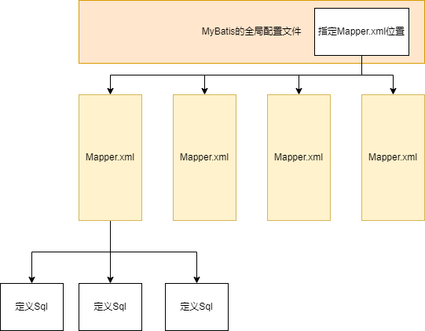

# MyBatis的动态SQL



在整个MyBatis的配置中，大概分为以上三种：

- mybatis-configuration.xml全局配置，定义MyBatis全局配置包括连接池、插件、日志打印、ObjectFactory等。
- Mapper.xml配置，其对应一个Java的interface，其主要用于配置Mapper的属性如：cache、sql、parameterMap，resultMap
- SQL定义配置，严格上来说其不算是一个配置，其对应Java的interface中特定的方法，可以配置需要执行的sql、statementType、lang、timeout、keyColum、keyProperties。

而对于这三种配置，MyBatis采用了三个具体的类来进行解析操作

1. mybatis-configuration.xml使用XMlConfigBuilder进行解析。
2. Mapper.xml使用XMLMapperBuilder进行解析
3. SQL定义使用XMlStatementBuilder进行解析

由于本文只关注动态SQL的构建，但是虽说SQL的定义实在XMLStatementBuilder中进行解析的，但实际上的动态SQL的构建却是在LanguageDriver中委派给XMLScriptBuidler进行的。

在XMLScriptBuilder中会将一段sql解析为一颗由SqlNode节点构成的树。例如对于如下Sql将会被解析为：

```java
    <select id="findById" resultType="xyz.wochib70.example.entity.ExampleEntity">
        SELECT *
        FROM example
        <where>
            <if test="id != null">
                id = #{id}
            </if>
        </where>
        <choose>
            <when test="id != null">
                LIMIT 1
            </when>
            <when test="id == null">
                ORDER BY id ASC
            </when>
            <otherwise>
                ORDER BY id DESC
            </otherwise>
        </choose>
    </select>
```

![[MyBatis动态Sql解析结果.png]]

在 XMLScriptBuilder 类中通过以下两个方法对动态 Sql 进行解析：

```java
  public SqlSource parseScriptNode() {
    MixedSqlNode rootSqlNode = parseDynamicTags(context);
    SqlSource sqlSource;
    if (isDynamic) {
      sqlSource = new DynamicSqlSource(configuration, rootSqlNode);
    } else {
      sqlSource = new RawSqlSource(configuration, rootSqlNode, parameterType);
    }
    return sqlSource;
  }

  protected MixedSqlNode parseDynamicTags(XNode node) {
    List<SqlNode> contents = new ArrayList<>();
    NodeList children = node.getNode().getChildNodes();
    for (int i = 0; i < children.getLength(); i++) {
      XNode child = node.newXNode(children.item(i));
      //如果当前节点为文本节点，则需要判断是否存在${}以确定是否是动态标签
      if (child.getNode().getNodeType() == Node.CDATA_SECTION_NODE || child.getNode().getNodeType() == Node.TEXT_NODE) {
        String data = child.getStringBody("");
        TextSqlNode textSqlNode = new TextSqlNode(data);
        if (textSqlNode.isDynamic()) {
          contents.add(textSqlNode);
          isDynamic = true;
        } else {
          contents.add(new StaticTextSqlNode(data));
        }
      } else if (child.getNode().getNodeType() == Node.ELEMENT_NODE) { // issue #628
        //如果当前节点问元素节点，则直接为动态标签
        String nodeName = child.getNode().getNodeName();
        NodeHandler handler = nodeHandlerMap.get(nodeName);
        if (handler == null) {
          throw new BuilderException("Unknown element <" + nodeName + "> in SQL statement.");
        }
        handler.handleNode(child, contents);
        isDynamic = true;
      }
    }
    return new MixedSqlNode(contents);
  }
```

可以看到MyBatis会通过以下两种方式判断当前的SqlSource是需要构建为DynamicSqlSource还是RawSqlSource

- 文本节点中是否存在`${}`
- 是否存在动态标签节点

上述两种主要满足其一就认为当前需要构建 DynamicSqlSource。

DynamicSqlSource 的作用是需要调用 OGNL 表达式，否则使用 RawSqlSource。

## MyBatis 处理#{}和${}

MyBatis 是在 TextSqlNode 节点中处理`${}`符号的。在 TextSqlNode 节点中可以看到具有两个内部类BindingTokenParser、DynamicCheckerTokenParser，它们都是 TokenHandler 接口的实现类，但是它们的作用却不一样。

TokenHandler 是在 GenericTokenParser 解析出占位符之后处理其中间文本的处理器。不同的 TokenHandler 实例可以在不同的 GenericTokenParser 中使用到达处理不同的占位符和进行不一样的处理效果。

在 TextSqlNode 中的两个内部类虽说都是处理`${}`的，但是DynamicCheckerTokenParser 的作用却是在 MyBatis 初始化阶段解析 Sql 时标记当前的 sql 标签是否是动态的。而BindingTokenParser 则是在运行时处理`${}`的。

由于 GenericTokenParser 的作用只是查询占位符位置以及取出占位符中间的内容，所以在这里可以直接查看 TokenHandler 的实现来看到 MyBatsi 对`${}`的处理过，BindingTokenParser 的 handleToken() 方法代码如下：

```java

    public String handleToken(String content) {
      Object parameter = context.getBindings().get("_parameter");
      if (parameter == null) {
        context.getBindings().put("value", null);
      } else if (SimpleTypeRegistry.isSimpleType(parameter.getClass())) {
        context.getBindings().put("value", parameter);
      }
      Object value = OgnlCache.getValue(content, context.getBindings());
      // issue #274 return "" instead of "null"
      String srtValue = value == null ? "" : String.valueOf(value); 
      checkInjection(srtValue);
      return srtValue;
    }
```

可以看到在第 9 行时 BindingTokenParser 直接使用 OGNL 库从 context.getBindings() 中获取了 content 的值，并且最终将其返回给了 GenericTokenParser 。而 GenericTokenParser 则是会将返回值填充到占位符的的位置。

MyBatis 处理`#{}`的方式和处理`${}`的方式一样只是 TokenHandler 的实例不同。其位置咋 DynamicSqlSource 和 RawSqlSource 中进行的。

```java
  public BoundSql getBoundSql(Object parameterObject) {
    DynamicContext context = new DynamicContext(configuration, parameterObject);
    rootSqlNode.apply(context);
    SqlSourceBuilder sqlSourceParser = new SqlSourceBuilder(configuration);
    Class<?> parameterType = parameterObject == null ? Object.class : parameterObject.getClass();
    SqlSource sqlSource = sqlSourceParser.parse(context.getSql(), parameterType, context.getBindings());
    BoundSql boundSql = sqlSource.getBoundSql(parameterObject);
    context.getBindings().forEach(boundSql::setAdditionalParameter);
    return boundSql;
  }
```

```java
  public RawSqlSource(Configuration configuration, SqlNode rootSqlNode, Class<?> parameterType) {
    this(configuration, getSql(configuration, rootSqlNode), parameterType);
  }

  public RawSqlSource(Configuration configuration, String sql, Class<?> parameterType) {
    SqlSourceBuilder sqlSourceParser = new SqlSourceBuilder(configuration);
    Class<?> clazz = parameterType == null ? Object.class : parameterType;
    sqlSource = sqlSourceParser.parse(sql, clazz, new HashMap<>());
  }

  private static String getSql(Configuration configuration, SqlNode rootSqlNode) {
    DynamicContext context = new DynamicContext(configuration, null);
    rootSqlNode.apply(context);
    return context.getSql();
  }

  @Override
  public BoundSql getBoundSql(Object parameterObject) {
    return sqlSource.getBoundSql(parameterObject);
  }
```

在 DynamicSqlSource 和 RawSqlSource 虽说都是使用 SqlSourceBuilder 进行解析`#{}`但是它们的调用解析时机却有不一样。这是由于 DynamicSqlSource 是动态 Sql 真正执行的 SQL 需要在执行时通过不同的参数决定的。而 RawSqlSource 则不需要在运行才确定，所以 RawSqlSource 解析`#{}`则是在构建对象的时候就直接进行解析。

在 SqlSourceBuilder.parse() 方法中使用的 TokenHandler 实现为 ParameterMappingTokenHandler。ParamterMappingTokenHandler 的作用是将当前传入的参数绑定到配置中的各种参数中去。
