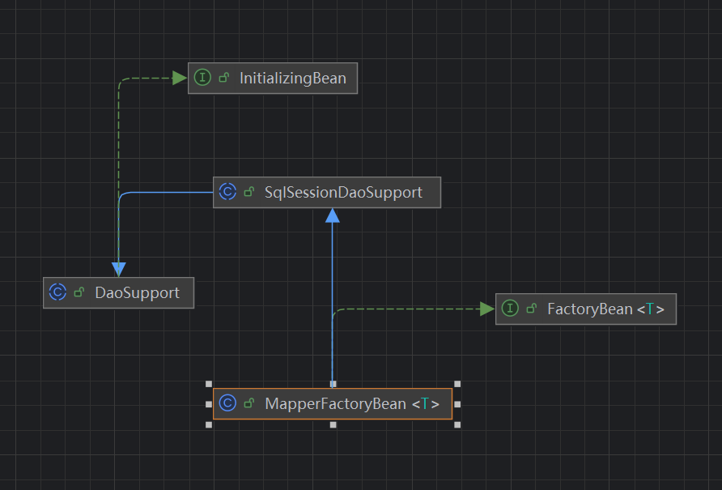

# MyBatis 整合 Spring

## 整合原生 Spring

### MyBatsi-Spring-Example

> [MyBatis 官方整合地址](http://doc.vrd.net.cn/mybatis/spring/zh/index.html)

导入 Maven 依赖

```xml
<dependency>
    <groupId>org.springframework</groupId>
    <artifactId>spring-context</artifactId>
    <version>6.2.3</version>
</dependency>
<dependency>
    <groupId>org.springframework</groupId>
    <artifactId>spring-jdbc</artifactId>
    <version>6.2.3</version>
</dependency>
<dependency>
    <groupId>org.mybatis</groupId>
    <artifactId>mybatis-spring</artifactId>
    <version>3.0.4</version>
</dependency>
<dependency>
    <groupId>org.mybatis</groupId>
    <artifactId>mybatis</artifactId>
    <version>3.5.17</version>
</dependency>
```

然后像使用原生 MyBatis 时一样编写 Mapper、Entity、Dao 文件。
然后便是最重要的编写 Spring 的配置文件，xml 或是 Java 类的配置文件都可以。
下面是使用 Java 类来编写 Spring 的配置文件。

```java
@Configuration
public class SpringApplicationConfiguration {

    @Bean
    public DataSource dataSource() {
        HikariDataSource dataSource = new HikariDataSource();
        String url = 
        "jdbc:mysql://localhost:3306/mybatis-example" + 
               "?useUnicode=true&characterEncoding=utf8&useSSL=false&serverTimezone=UTC"
        dataSource.setJdbcUrl(url);
        dataSource.setDriverClassName("com.mysql.cj.jdbc.Driver");
        dataSource.setUsername("root");
        dataSource.setPassword("123456");
        return dataSource;
    }

    @Bean
    public MapperScannerConfigurer mapperScannerConfigurer(){
        MapperScannerConfigurer mapperScannerConfigurer = new MapperScannerConfigurer();
        mapperScannerConfigurer.setBasePackage("xyz.wochib70.mybatis.spring.dao");
        return mapperScannerConfigurer;
    }

    @Bean
    public SqlSessionFactory sqlSessionFactoryBean(DataSource dataSource) throws Exception {
        SqlSessionFactoryBean sqlSessionFactoryBean = new SqlSessionFactoryBean();
        sqlSessionFactoryBean.setDataSource(dataSource);
        sqlSessionFactoryBean.setConfigLocation(new PathMatchingResourcePatternResolver()
                                                    .getResource("classpath:mybatis-configuration.xml"));
        return  sqlSessionFactoryBean.getObject();
    }

}
```

然后在 main 方法中使用 Spring 并直接获取 Dao 实例就可以像原生 MyBatis 一样了。

```java
    public static void main(String[] args) {
        ApplicationContext context = 
                        new AnnotationConfigApplicationContext(SpringApplicationConfiguration.class);
        ExampleDao mapper = context.getBean(ExampleDao.class);
        long id = new Random().nextLong(1231L, 8456456456465L);
        ExampleEntity entity = ExampleEntity.builder()
                .id(id)
                .name("test")
                .description("spring mybatis test")
                .build();
        mapper.insert(entity);
        ExampleEntity example = mapper.findById(id);
        System.out.println(example);
    }
```

### MyBatis 整合 Spring 的原理

在通过 Spring 来使用 MyBatis 时，可以从 Spring 的 Bean 容器中直接获取到 MyBatis 内部的 Dao 实例。
在配置 Spring 的配置文件时，我们手动的向 Bean 容器中注册了三个 Bean 的实例分别为：`DataSource`、`MapperScannerConfigurer`、`SqlSessionFactory`。但是这个时候的 `SqlSessionFactory` 却是通过 `SqlSessionFactoryBean` 获取后再注入到 Bean 容器中去的。如果这个地方不注入 `SqlSeesionFactory` 的实例，而是像 Bean 容器中直接注入 `SqlSessionfactoryBean` 其实也是可以的。这和 `SqlSessionFactoryBean` 实例所实现的接口 `FactoryBean` 有关。

> `FactoryBean<T>` 是 Spring 的一个拓展接口，用于向 Spring 容器中注入一个 Bean 用于获取其泛型的 Bean 实例。
> 其子接口 `SmartFactoryBea` 被大量使用在框架内部，如 Spring AOP 相关操作类就是实现了该接口

而在 Spring Bean 容器中注入 `SqlSessionFactory` 也只能从容器中获取到 `SqlSessionFactory` 实例。之后才能从 `SqlSessionFactory` 中获取到 Dao 的实例。但是示例中却是直接从 Spring Bean 容器中直接获取到了 Dao 的实例。这边需要关注到 `MapperScannerConfigurer` 这个注入到 Spring 中的 Bean 了。

`MapperScannerConfigurer` 类实现类四个 Spirng 的拓展接口，分别为：

- `BeanDefinitionRegistryPostProcessor`
- `ApplicationContextAware`
- `InitializingBean`
- `BeanNameAware`

这四个接口中最终的接口显然是 `BeanDefinitionRegistryPostProcessor` , `BeanDefinitionRegistryPostProcessor` 允许实现此接口的 Bean 在 Spring 容器所有的 Bean 都被注册完成之后，未被实例化之前对 BeanDefinition 进行增删改的操作。

在 `BeanDefinitionRegistryPostProcessor#postProcessBeanDefinitionRegistry()` 的代码如下：

```java
  @Override
  public void postProcessBeanDefinitionRegistry(BeanDefinitionRegistry registry) {
    if (this.processPropertyPlaceHolders) {
      processPropertyPlaceHolders();
    }

    var scanner = new ClassPathMapperScanner(registry, getEnvironment());
    scanner.setAddToConfig(this.addToConfig);
    scanner.setAnnotationClass(this.annotationClass);
    scanner.setMarkerInterface(this.markerInterface);
    scanner.setExcludeFilters(this.excludeFilters = mergeExcludeFilters());
    scanner.setSqlSessionFactory(this.sqlSessionFactory);
    scanner.setSqlSessionTemplate(this.sqlSessionTemplate);
    scanner.setSqlSessionFactoryBeanName(this.sqlSessionFactoryBeanName);
    scanner.setSqlSessionTemplateBeanName(this.sqlSessionTemplateBeanName);
    scanner.setResourceLoader(this.applicationContext);
    scanner.setBeanNameGenerator(this.nameGenerator);
    scanner.setMapperFactoryBeanClass(this.mapperFactoryBeanClass);
    if (StringUtils.hasText(lazyInitialization)) {
      scanner.setLazyInitialization(Boolean.parseBoolean(lazyInitialization));
    }
    if (StringUtils.hasText(defaultScope)) {
      scanner.setDefaultScope(defaultScope);
    }
    scanner.registerFilters();
    scanner.scan(StringUtils.tokenizeToStringArray(this.basePackage, 
                                            ConfigurableApplicationContext.CONFIG_LOCATION_DELIMITERS));
  }
```

在基础使用中可以直接查看 `scanner#scan()` 方法，而 `scanner` 则是 `ClassPathMapperScanner` 类的实例。

`ClassPathMapperScanner` 类是 `ClassPathBeanDefinitionScanner` 的子类。类如其名 `ClassPathBeanDefinitionScanner` 的作用是用来扫描类路径下的 Bean 用于向 Spring 容器中注册 `BeanDefinition` 的。

`ClassPathMapperScanner` 重写了三个方法：

- `isCandidateComponent`
- `doScan`
- `checkCandidate`

`isCandidateComponent` 的作用实在扫描到 Java 任意可被注册的资源时，用于判断该资源能否被注册到 Spring 容器中。`ClassPathMapperScanner`对其的重写如下：

```java
@Override
protected boolean isCandidateComponent(AnnotatedBeanDefinition beanDefinition) {
    return beanDefinition.getMetadata().isInterface() && beanDefinition.getMetadata().isIndependent();
}
```

`ClassPathMapperScanner` 值判断当前需要注册的资源是否是接口和当前资源是否是独立类（非内部类）。

而 `doScan` 方法则更是简单，将整个扫描任务委派给父类，然后自己在通过 `processBeanDefinitions` 处理由父类扫描到的资源。由于 `processBeanDefinitions` 方法的实现比较长。这里就只关注其关键代码。

```java
  private Class<? extends MapperFactoryBean> mapperFactoryBeanClass = MapperFactoryBean.class;
  private void processBeanDefinitions(Set<BeanDefinitionHolder> beanDefinitions) {
    AbstractBeanDefinition definition;
    var registry = getRegistry();
    for (BeanDefinitionHolder holder : beanDefinitions) {
      definition = (AbstractBeanDefinition) holder.getBeanDefinition();
      ...
      var beanClassName = definition.getBeanClassName();
      definition.getConstructorArgumentValues().addGenericArgumentValue(beanClassName); // issue #59
      try {
        Class<?> beanClass = Resources.classForName(beanClassName);
        definition.setAttribute(FACTORY_BEAN_OBJECT_TYPE, beanClass);
        definition.getPropertyValues().add("mapperInterface", beanClass);
      } catch (ClassNotFoundException ignore) {
      }
      definition.setBeanClass(this.mapperFactoryBeanClass);
      definition.getPropertyValues().add("addToConfig", this.addToConfig);
      ...
    }
  }
```

可以看到在后置处理扫描到的 Bean 后，将其 Class 修改为 `MapperFactoryBean.class` 而这个类的实现也是由 MyBatis 所提供的。并且 MyBatis 这里还添加了两个属性： `mapperInterface`、`addToConfig`。值分别是原本的 Class 和 true 。

由于 MyBatis 将所有待注入的 Dao 的类型修改为 `MapperFactoryBean` 。所以在 `MapperFactoryBean` 中才可以知道 `MyBatis` 是如何将 Dao 注入到 Spring 容器中的。

`MapperFactoryBean` 的继承关系如下：


可以得知 `MapperFactoryBean` 本质上是一个 `FactoryBean` 用于生产 Bean 的工厂，而他又继承 Spring 的拓展接口的实现类 `SqlSessionDaoSupport` 所以可以直接查看其拓展方法 `afterProperties()` 。此方法在 `DaoSupport` 类中进行了实现，并在其中定义了抽象方法 `checkDaoConfig()` 。在 `MapperFactoryBean` 中对 `checkDaoConfig()` 方法进行了实现，其代码如下：

```java
  @Override
  protected void checkDaoConfig() {
    super.checkDaoConfig();

    notNull(this.mapperInterface, "Property 'mapperInterface' is required");

    var configuration = getSqlSession().getConfiguration();
    if (this.addToConfig && !configuration.hasMapper(this.mapperInterface)) {
      try {
        configuration.addMapper(this.mapperInterface);
      } catch (Exception e) {
        logger.error("Error while adding the mapper '" + this.mapperInterface + "' to configuration.", e);
        throw new IllegalArgumentException(e);
      } finally {
        ErrorContext.instance().reset();
      }
    }
  }
```

可以看到在初始化时 `MapperFactoryBean` 会将构建 Dao 的职责委派给，MyBatis 的 Configuration。至此 Spring 容器中可以直接借由 `MapperFactoryBean` 获取到 Configuration 中的代理实例。

这是在 `MapperFactoryBean` 中获取 Dao 的方法：

```java
@Override
public T getObject() throws Exception {
  return getSqlSession().getMapper(this.mapperInterface);
}
```

在获取 Dao 实例的时候 `getSqlSeesion()` 方法获取的实例并不是配置 Spring 时候注入的 `SqlSessionFactory` 所生产的 `SqlSession`。这是因为 MyBatis 还需要和 Spring 的事务管理相结合。

## 整合 SpringBoot
