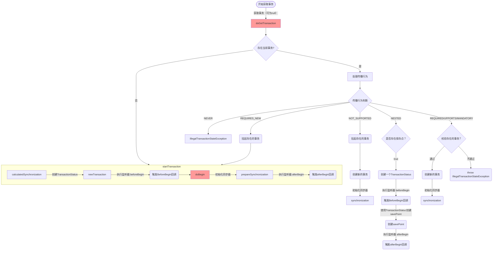

# Spring 的事务管理模块

## Spring-tx 模块的顶级接口

### TransactionManager 事物管理器

TransactionManager 是一个标记接口，其内部没有定义任何东西。

具体的功能都在子接口中定义，其具备三个子接口

- `ConfigurableTransactionManager` : 用于提供 `TransactionExecutionListener` 注册能力，其子接口一般为其他两个接口的实现。此接口仅仅表示实现类应该提供事务监听器的功能，以监听事务执行的各个阶段。
- `PlatformTransactionManager` : Spring 事务抽象的核心接口，负责事务的创建、提交、回滚等生命周期管理。
- `ReactiveTransactionManager` : 使用 WebFlux 时的事务核心接口，负责事务的创建、提交、回滚等生命周期管理。

由于在 SpringBoot 的开发之中 JDBC 关系型数据库使用的最多，并且JDBC事务视线的核心 `JdbcPlatformTransactionManager` 是 `PlatformTransactionManager` 的实现类，所以这里关注的重点是 `PlatformTransactionManager` 接口。在 `PlatformTransactionManager`  接口中定义了三个抽象方法如下：

| 方法名称           | 入参                    | 出参                | 作用                                                                                                               |
| ------------------ | ----------------------- | ------------------- | ------------------------------------------------------------------------------------------------------------------ |
| `getTransaction()` | `TransactionDefinition` | `TransactionStatus` | 通过事务定义（`TransactionDefinition`）来获取一个事务状态（`TransactionStatus`），可以是新建的也可以是已经存在的。 |
| `commit()`         | `TransactionStatus`     |                     | 完成给定的 `TransactionStatus`。根据 `TransactionStatus` 的状态来决定进行提交还是回滚                              |
| `rollback()`       | `TransactionStatus`     |                     | 执行给定的 `TransactionStatus` 的回滚。                                                                            |

在 SpringBoot 的设计中接口仅仅提供功能的定义，而 SpringBoot 常常使用模板类来定义功能的流程，特定化的小功能则需要具体的视线类来实现（例如 `AbstractApplicationContext` 其自身并不提供 `BeanDefinition` 的解析，具体的解析流程则由不同的子类视线）。而在这里提供模板流程的类则是 `AbstractPlatformTransactionManager` 。

模板类 `AbstractPlatformTransactionManager` 不光视线类 `PlatformTransactionManager` 接口，还实现了 `ConfigurableTransactionManager` 接口用以为自身提供事务监听器的能力，并且模板类定义了 `PlatformTransactionManager` 接口中的三个方法的流程模板。

**`getTransaction()`** 的流程模板如下所示：



**commit()** 流程模板如下所示：

```mermaid
flowchart TD
    start([commit开始]) --> isRollBack{事务需要回滚?}
    isRollBack -->|需要回滚| processRollBack

    subgraph processRollBack
        beforeCompletion(触发同步器回调beforeCompletion) --> if{判断当前事务状态}
        if --> hasSavePoint(存在保存点)
        hasSavePoint --> beforeRollbackForSave(事务监听器beforeRollBack回调)
        beforeRollbackForSave --> rollbackToSavePoint(回滚到保存点)

        if --> isNewTransaction(当前事务被认定为新事务)
        isNewTransaction --> beforeRollbackForNew(事务监听器beforeRollBack回调)
        beforeRollbackForNew --> doRollback

        if --> inLargeTransaction(处于更大的事务中)
        inLargeTransaction --> setRollbackOnlySatatu(设置回滚状态，如果需要)

        rollbackToSavePoint --> afterCompletion(触发同步器回调afterCompletion)
        doRollback --> afterCompletion(触发同步器回调afterCompletion)
        setRollbackOnlySatatu --> afterCompletion(触发同步器回调afterCompletion)
        afterCompletion --> afterRollback(执行监听器回调afterRollback)

        afterRollback --> cleanupAfterCompletion(清除当前的同步监听器，已经释放存在的被保存资源)
    end

    isRollBack -->|不需要回滚| processCommit
    
    subgraph processCommit
        prepareCommit(提交预处理) --> triggerBeforeCommit(触发同步器回调beforeCommit)
        triggerBeforeCommit --> triggerBeforeCompletion(触发同步器回调beforeCompletion)
        triggerBeforeCompletion --> ifCommit{判断当前事务状态}

        ifCommit --> commitHasSavePoint(当前事务存在保存点)
        commitHasSavePoint --> beforeCommit(事务监听器回调beforeCommit)
        beforeCommit --> releaseSavePoint(释放保存点)

        ifCommit --> commitIsNewTransaction(当前事务被认定为新事务)
        commitIsNewTransaction --> beforeCommitForNew(事务监听器回调beforeCommit)
        beforeCommitForNew --> doCommit

        doCommit --> triggerAfterCommit(触发同步器回调afterCommit)
        releaseSavePoint --> triggerAfterCommit
        triggerAfterCommit --> triggerAfterCompletion(触发同步器回调afterCompletion)
        triggerAfterCompletion --> listenerAfterCommit(触发事务监听器回调afterCommit)
        listenerAfterCommit --> cleanupAfterCompletionForCommit(清除当前的同步监听器，已经释放存在的被保存资源)
    end

    style doRollback fill:#f99
    style doCommit fill:#f99
```



**rollback()** 流程模板则直接调用 processRollback 流程。

### TransactionDefinition 事务定义

用于定义 Spring 中的 Transaction 的一些基本信息。

- 事物传播行为
- 事物隔离级别
- 超时时长
- 是否是只读事务

-----

Spring 的事物传播行为：

| 事物传播行为                                    | 实际数值 | 描述                                                                                                                                                              |
| ----------------------------------------------- | -------- | ----------------------------------------------------------------------------------------------------------------------------------------------------------------- |
| TransactionDefinition.PROPAGATION_REQUIRED      | 0        | 如果当前存在事物则加入，否则创建一个事物                                                                                                                          |
| TransactionDefinition.PROPAGATION_SUPPORTS      | 1        | 支持当前事物，如果不存在则以非事物方式运行                                                                                                                        |
| TransactionDefinition.PROPAGATION_MANDATORY     | 2        | 强制要求外部必须有事务，否则直接抛出 IllegalTransactionStateException。                                                                                           |
| TransactionDefinition.PROPAGATION_REQUIRES_NEW  | 3        | 始终新建独立事务，外部事务被挂起。新事务与外部事务完全隔离，互不影响提交/回滚。                                                                                   |
| TransactionDefinition.PROPAGATION_NOT_SUPPORTED | 4        | 强制非事务执行，若外部存在事务则挂起。适用于事务不支持的场景（如某些数据库操作）。                                                                                |
| TransactionDefinition.PROPAGATION_NEVER         | 5        | 严格禁止事务存在，若外部有事务则抛出异常。用于确保无事务上下文的环境。                                                                                            |
| TransactionDefinition.PROPAGATION_NESTED        | 6        | 在外部事务中嵌套子事务（通过保存点实现）。子事务回滚不影响外部事务，但外部事务回滚会连带子事务回滚。若外部无事务，则退化为新建事务（类似 PROPAGATION_REQUIRED）。 |

Spring 的事物隔离级别:

| 事物隔离级别               | 实际数值 | 等价值                                           | 描述                                                                         |
| -------------------------- | -------- | ------------------------------------------------ | ---------------------------------------------------------------------------- |
| ISOLATION_DEFAULT          | -1       |                                                  | 使用底层数据库的默认隔离级别                                                 |
| ISOLATION_READ_UNCOMMITTED | 1        | java.sql.Connection.TRANSACTION_READ_UNCOMMITTED | 允许读取未提交的数据（脏读、不可重复读、幻读均可能发生）                     |
| ISOLATION_READ_COMMITTED   | 2        | java.sql.Connection.TRANSACTION_READ_COMMITTED   | 只能读取已提交的数据（防止脏读，但不可重复读、幻读可能发生）                 |
| ISOLATION_REPEATABLE_READ  | 4        | java.sql.Connection.TRANSACTION_REPEATABLE_READ  | 确保同一事务中多次读取同一数据结果一致（防止脏读、不可重复读，幻读可能发生） |
| ISOLATION_SERIALIZABLE     | 8        | java.sql.Connection.TRANSACTION_SERIALIZABLE     | 所有事务串行化执行（防止脏读、不可重复读、幻读，但性能最低）                 |

隔离级别与并发问题关系：

| 隔离级别         | 脏读（Dirty Read） | 不可重复读（Non-Repeatable Read） | 幻读（Phantom Read） |
| ---------------- | ------------------ | --------------------------------- | -------------------- |
| READ_UNCOMMITTED | ✅ 可能             | ✅ 可能                            | ✅ 可能               |
| READ_COMMITTED   | ❌ 禁止             | ✅ 可能                            | ✅ 可能               |
| REPEATABLE_READ  | ❌ 禁止             | ❌ 禁止                            | ✅ 可能               |
| SERIALIZABLE     | ❌ 禁止             | ❌ 禁止                            | ❌ 禁止               |

### TransactionStatus 事务状态

TransactionStatus 是 Spring 事务管理的核心接口之一，用于表示一个事务的​​运行时状态​​，并提供对事务行为的控制能力（如标记回滚、创建保存点等）。它是事务在运行时的句柄（Handle），允许开发者在编程式事务中直接操作事务的生命周期。

TransactionStatus 主要有以下几个作用

- ​状态查询​​：判断事务是否完成、是否被标记为回滚。
- ​事务控制​​：强制标记事务回滚。
- ​保存点管理​​（嵌套事务）：创建、回滚到指定的保存点。
- ​资源管理​​：绑定事务资源（如数据库连接）到当前线程。

## Spring 中事务的使用

### 使用 PlatformTransactionManager 实现

```java
TransactionStatus transaction = platformTransactionManager.getTransaction(new DefaultTransactionDefinition());
try {
    doSomething();
    platformTransactionManager.commit(transaction);
} catch (Exception e) {
    transaction.setRollbackOnly();
    platformTransactionManager.rollback(transaction);
}
```

### 使用 TransactionTemplate 实现

```java
transactionTemplate.execute(action -> {
    try {
        doSomething();
        return 1;
    } catch (Exception e) {
        action.setRollbackOnly();
    }
    return -1;
});
```

### 使用 @Transactional 注解实现

```java
@Transactional
public void batchInsert(List<TransactionEntity> transactions, Random random) {
    doSomething();
}
```

## @EnableTransactionManager 开启发生了什么？

注解  `EnableTransactionManager` 的定义如下所示：

```java
@Target(ElementType.TYPE)
@Retention(RetentionPolicy.RUNTIME)
@Documented
@Import(TransactionManagementConfigurationSelector.class)
public @interface EnableTransactionManagement {

    boolean proxyTargetClass() default false;

    AdviceMode mode() default AdviceMode.PROXY;

    int order() default Ordered.LOWEST_PRECEDENCE;

    RollbackOn rollbackOn() default RollbackOn.RUNTIME_EXCEPTIONS;
}
```

其有一个元注解 `Import` 导入了 `TransactionManagementConfigurationSelector` 的 Class。这个类是 `ImportSelector` 的实现类。其作用是在 BeanDefinitionRegistry 注入一些 Bean。而 `TransactionManagementConfigurationSelector` 则是注册了以下两个类：

- org.springframework.context.annotation.AutoProxyRegistrar
- org.springframework.transaction.annotation.ProxyTransactionManagementConfiguration

在 `AutoProxyRegistrar` 中其向 `BeanFactory` 中注册了一个 `InfrastructureAdvisorAutoProxyCreator` 的 BeanDefinition 。其作用是实现 Spring 的 AOP 功能。
在 `ProxyTransactionManagementConfiguration` 中则是向 `BeanFactory` 中注册了四个 Bean。分别为：

- org.springframework.transaction.event.TransactionalEventListenerFactory
- org.springframework.transaction.interceptor.TransactionAttributeSource
- org.springframework.transaction.interceptor.BeanFactoryTransactionAttributeSourceAdvisor
- org.springframework.transaction.interceptor.TransactionInterceptor

可以看到在 `ProxyTransactionManagementConfiguration` 中注册的 Bean 都是 Spring-tx 模块下的类。此时如果我们熟悉 Spring 的 AOP 机制，就会发现 `InfrastructureAdvisorAutoProxyCreator` 是 AOP 核心抽象类 `AbstractAdvisorAutoProxyCreator` 的实现。`AbstractAdvisorAutoProxyCreator` 的实现类都会维护一个 `Advisor` 列表用于判断是否要对指定 Bean 进行代理操作。对于实现类而言一般只需要关注子类的 `isEligibleAdvisorBean()` 方法即可知道这一个实现类最终会维护怎样一个 `Advisor` 列表。而 `InfrastructureAdvisorAutoProxyCreator` 的实现如下：

```java
@Override
protected boolean isEligibleAdvisorBean(String beanName) {
    return (this.beanFactory != null && this.beanFactory.containsBeanDefinition(beanName) &&
            this.beanFactory.getBeanDefinition(beanName).getRole() == BeanDefinition.ROLE_INFRASTRUCTURE);
}
```

这表示其只管理完全由后台创建的 `Advisor` 。而由 `ProxyTransactionManagementConfiguration` 配置类注入的 `BeanFactoryTransactionAttributeSourceAdvisor` 正好是这样的 `Advisor` 。

至此知道了 Spring—tx 模块是通过 AOP 来进行实现的。现在就可以查看 `ProxyTransactionManagementConfiguration` 向 Spring 容器注册的 Bean。

### BeanFactoryTransactionAttributeSourceAdvisor

Spring 框架将 AOP 抽象为三个部分：`Pointcur`、`Advice` 和 `Advisor`。其中 `Pontcut` 是一个判断条件（即用于判断当前 Bean 是否需要被代理），`Advice` 则是代理实现的方法（可以看作为 JDK 动态代理中的 Invocation），而 `Advisor` 则是维护着一个 `Pointcut` 和 `Advice` 。

`BeanFactoryTransactionAttributeSourceAdvisor` 看名字就知道其是一个 `Advisor`。其内部维护着 `TransactionAttributeSourcePointcut` 和 `TransactionInterceptor` 。

### TransactionAttributeSourcePointcut


